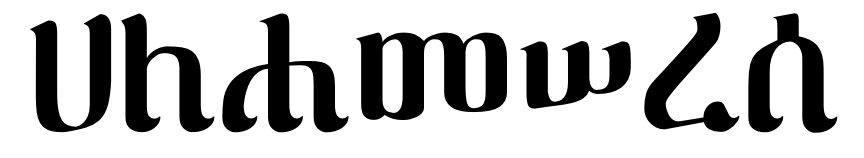

# The Waldba Font Collection

The goal of the Waldba project is to help preserve the *digital typography heritage* of Ge'ez (Ethiopic) script.
Preservation is accomplished by migrating computer fonts, primarily outline fonts, to OpenType format under Unicode
encoding.  The computer fonts to preserve, in turn, are those that are no longer actively maintained by their creators.
Where the creator may have moved on to other projects, might be a company that has been defunct for decades, or an
individual who has passed away.  The initial focus are fonts of the 1990s and those of released under an open source license.

The intial fonts in migrated under the Waldba project come from WashRa collection of the [Senamirmir Project](https://senamirmir.org/).

**About the name:** just as the original font collection was named after the Washera Mariam monestary, this collection is named after reknowned another monetary of Ethiopian.
[ዋልድባ /  Waldba](http://www.iueotcff.org/waldba/about) is situated in northern Ethiopia that has faced unprecedented challenges for its survival in in recent years.

## Background
The Educational Fontware company developed a collection of 14 fonts that illustrate the sequence and direction of written strokes needed to form the Geʾez letters. The collection was developed over a two year period and generously released in 2011 under the [Open Font License](OFL.txt) (OFL). The motivation behind developing the font collection was for use in Ethiopia and Eritrea elementary school education.  The collection was provided to the respective governments, however, the extent of their utilization is unknown.

The "Zelan" typeface was originally created by the Senamirmir Project and distributed as part of the WashRa font collection.  The ዘላን font is a continuation of Zelan since its last update by the Senamirmir Project in 2008 in the WashRa 4.1 release. 

## Goals
The goal of this project is to extend the fonts with the Ethiopic letters that have been added to the Unicode Standard since the release of the original collection.  
continuation of Zelan since its last update by the Senamirmir Project in 2008 in the WashRa 4.1 release. 
Under this goal, the primary focus of the project is to add the letters needed to support the writing practices of living languages that use the Ethiopic (Geʾez) script such at Blin and Gurage.

## The Collection
The collection presently includes the following typefaces from the WashRa collection.  Additional fonts from the collection (Ethiopic WashRa Bold, Ethiopic WashRa SemiBold, etc) may be added later, as well as fonts from other foundaries that are no longer actively maintained.

### ዋልድባ - ዘላን
*Ethiopic Zelan → ዋልድባ - ዘላን* and may be transcribed as "Waldba - Zelan".  "Zelan" translates to "Nomad" and is a sans serif typeface style featuring rounded stroke ends.

### ዋልድባ - ህዋእ
*Ethiopic Hiwua → ዋልድባ - ህዋእ* and may be trascribed as "Waldba - Hiwua".  "Hiwua" translates to "Space" and is a sans serif typeface style featuring rounded stroke ends and single winged serifs.

### ዋልድባ - የብሰ
*Ethiopic Yebse → ዋልድባ - የብሰ* and may be trascribed as "Waldba - Yebse".  "Yebse" translates to "Mature" and is a sans serif typeface style featuring rounded stroke ends and double winged serifs.

### ዋልድባ - ጅረት
*Ethiopia Jiret → ዋልድባ - ጅረት* and may be trascribed as "Waldba - Jiret".  "Jiret" translates to "Stream" and is an optimization of the classic serif style for computer screens.

### ዋልድባ - ውቂያኖስ
*Ethiopic Wookianos → ዋልድባ - ውቂያኖስ* and may be trascribed as "Waldba - Wookianos".  "Wookianos" translates to "Ocean" and is a serif typeface style featuring single winged serifs.

### ዋልድባ - ፋንትዋ
*Ethiopic Fantuwua → ዋልድባ - ፋንትዋ* and may be transcribed as "Waldba - Fantuwua".  "Fantuwua" translates to "???" and is a serif typeface style featuring flat stroke ends and single winged serifs.

### ዋልድባ - ጥንት
*Ethiopic Tint → ዋልድባ - ጥንት* and may be trascribed as "Waldba - Tint".  "Tint" translates to "Old Times", or "Long Ago" and is a blackletter style typeface.

### ዋልድባ - ይገዙ ብሥራት ጎቲክ
*Ethiopic Yigezu Bisrat Gothic → ዋልድባ - ይገዙ ብሥራት ጎቲክ* and may be trascribed as "Waldba - Yigezu Bisrat Gothic"

"Yigezu Bisrat Gothic" is named after the reknowned artist, Yigezu Bisrat, and Gothic (transcribed in Amharic as "ጎቲክ") is the English word which describes the typeface style.

### ዋልድባ - ይገዙ ብሥራት ጎፈር
*Ethiopic Yigezu Bisrat Goffer → ዋልድባ - ይገዙ ብሥራት ጎፈር* and may be trascribed as "Waldba - Yigezu Bisrat Goffer" is a sophisticated blackletter style typeface suitable for wedding invitations and diplomas.
"Yigezu Bisrat Goffer" is named after the reknowned artist, Yigezu Bisrat, and Goffer (transcribed in Amharic as "ጎፈር") is the English word meaning to press pleats, ridges or other wavy designs with an iron into fabric.

## Status

Work on meeting full Unicode standard compliance is prioritized around completing first the letters and symbols in current use. The letters in current, modern use by the languages of
Eritrea and Ethiopia are given in this table for the [Modern Ethiopic Syllabary](ModernSyllabary.md) 

**Missing Symbols by Range:**

|                       |  Basic |Supplement| Extended |Extended-A|Extended-B|
|:---------------------:|:------:|:--------:|:--------:|:--------:|:--------:|
|ዋልድባ - ዘላን                           |    13  |    26    |    75    |    32    |    28    |
|ዋልድባ - ህዋእ                          |    13  |    26    |    79    |    32    |    28    |
|ዋልድባ - የብሰ                           |    13  |    26    |    75    |    32    |    28    |
|ዋልድባ - ጅረት                           |    12  |     8    |    75    |    32    |     0    |
|ዋልድባ - ውቂያኖስ                    |    12  |    18    |    75    |    32    |     0    |
|ዋልድባ - ፋንትዋ                       |    12  |    18    |    79    |    32    |     0    |
|ዋልድባ - ጥንት           |    15  |    26    |    75    |    32    |    28    |
|ዋልድባ - ይገዙ ብሥራት ጎቲክ|    13  |    26    |    79    |    32    |    28    |
|ዋልድባ - ይገዙ ብሥራት ጎፈር|    13  |    26    |    75    |    32    |    28    |
